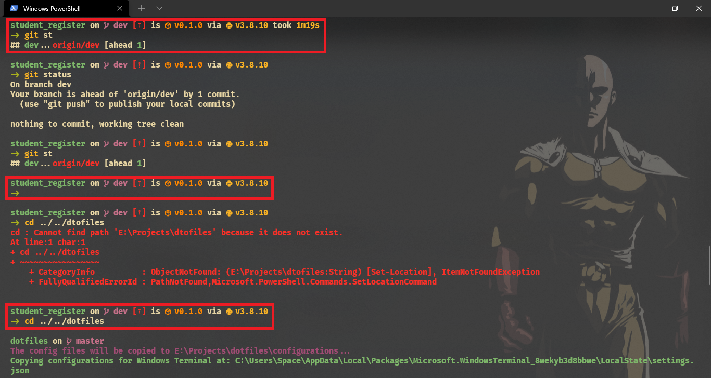

# Starship

[Starship][Starship] is a cross-platform customizable prompt which was written in Rust & is **super-fast**. Also, unlike most other prompt customization tools, Starship requires close to no user configuration. It just works pretty well (_and beautifully_) right out of the box!

That said, you can have a look at the `starship.toml` files & see it's pretty minimal. But don't be fooled with the minimal configurations! Take a look & see for yourself what this minimally configured prompt looks like on Windows Terminal:



**NOTE**: _The areas marked with red boxes are the shell prompts._

So, if it piqued your interests, keeping reading ahead. In this README you'll find all the instructions to properly set up Starship on your Windows machine as well.

## Setting Up Starship

1. Download the [Starship Binary][Starship Binary] either from GitHub or through Scoop (__which is the recommended way to get it__).
2. Ensure the binary is available on `$PATH` (Scoop takes care of it for you automatically though).
3. Add the following lines to your `$PROFILE` file with the following lines:

    ```powershell
    # Loads the Starship prompt for PowerShell
    Invoke-Expression (&starship init powershell)

    # Configures the %TEMP% folder for Starship caching
    $ENV:STARSHIP_CACHE = Resolve-Path -Path $ENV:TEMP

    # Configures the path to the starship.toml file
    $ENV:STARSHIP_CONFIG = Resolve-Path -Path "$ENV:USERPROFILE\.starship\starship.toml
    ```

4. Then create a `.starship` directory at `%USERPROFILE%`. The `starship.toml` file will go inside the `.starship` folder.
5. Copy of the contents of [starship.toml](starship.toml) in this repository to the file you just created.

    Contents of the [starship.toml](starship.toml) file in this repo:

    ```toml
    # Increase the default timeout duration for long-running operations
    command_timeout = 2000

    [character]
    success_symbol = "[->](bold green)"

    [docker_context]
    symbol = " "

    [package]
    symbol = " "

    [python]
    symbol = " "

    [git_branch]
    symbol = " "
    ```

    **NOTE**: Some contents has been removed from the [starship.toml](starship.toml) file. Refer to the hyperlink for a better reference.

6. Then run the `. $Profile` to reload the PowerShell profile.
7. Enjoy & share a screenshot of your terminal with the rest of the world!

## Quick Setup Using PowerShell Command

It's possible & actually recommended to use PowerShell Cmdlets to quicky set up the environment. You should do it moreso if it's only Starship that you want & not everything else I use here.

That said, add the following commands to a PowerShell session. And here's a tip for you, use [Windows Terminal](../windows-terminal) for all your command-line requirements.

```powershell
$StarshipConfigDirectory = Resolve-Path -Path "$ENV:USERPROFILE\.starship"
$StarshipConfig = Resolve-Path -Path $StarshipConfigDirectory\starship.toml
$PowerShellConfigs = "https://raw.githubusercontent.com/Jarmos-san/dotfiles-windows/master/configurations/windows-powershell/Microsoft.PowerShell_profile.ps1"
$RemoteStarshipConfigs = "https://raw.githubusercontent.com/Jarmos-san/dotfiles-windows/master/configurations/starship/starship.toml"

# Create the necessary folders first
New-Item -ItemType "Directory" -Path "$ENV:HOMEDRIVE\Tools", $StarshipConfigDirectory -Force

# Create the Starship configuration file
New-Item -ItemType "File" -Path $StarshipConfig

# Use Scoop to download Starship
Invoke-Expression -Command "scoop install starship"

# Add content to the $PROFILE
Set-Content -Path $PROFILE -Value (Invoke-WebRequest -Uri $PowerShellConfigs).Content

# Add content to the %USERPROFILE%\.starship\starship.toml file
Set-Content -Path $StarshipConfig -Value (Invoke-WebRequest -Uri $RemoteStarshipConfigs).Content

# Reload your current PowerShell session
. $Profile
```

## Notes to Remember

Do note, I'm using the patched version of Fira Code. It's available at [Nerd Fonts][Nerd Fonts], so do check it out if you want a similar experience. Also, by default Starship uses emojis in the prompt which I dislike. Hence, I replaced them with Nerd Font icons instead :grinning_face_with_smiling_eyes:

So, if you want to customize your Starship prompt according to your needs, definitely refer to the official [configuration docs][Starship Configurations].

<!-- Reference Links -->
[Starship]: https://starship.rs/
[Starship Binaries]: https://github.com/starship/starship/releases
[Nerd Fonts]: https://www.nerdfonts.com/
[Starship Configurations]: https://starship.rs/config/
